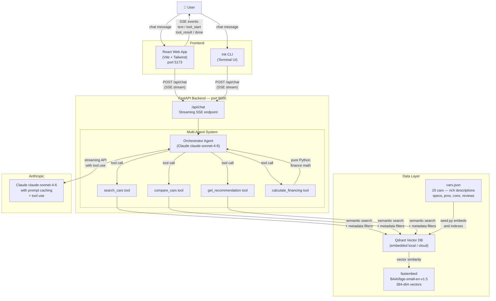

# VroomIQ

A multi-agent RAG-powered car shopping assistant. Ask in plain English — the AI searches a vector database, compares cars, generates personalized recommendations, and calculates financing in real time.

---

## Live URLs

| Environment | URL |
|---|---|
| Web App (local) | http://localhost:5173 |
| API (local) | http://localhost:8000 |
| API Docs (local) | http://localhost:8000/docs |
| Web App (production) | https://vroomiq-viayx.ondigitalocean.app |
| API (production) | https://vroomiq-viayx.ondigitalocean.app/api |
| API Docs (production) | https://vroomiq-viayx.ondigitalocean.app/docs |

---

## Architecture



### Simplified flow

```
User message
    │
    ▼
FastAPI  ──SSE stream──►  React (text streams in real time)
    │
    ▼
Orchestrator (Claude claude-sonnet-4-6)
    │
    ├── decides intent → calls tool(s)
    │
    ├── search_cars ──────► Qdrant semantic search
    │                         (query embedding + metadata filters)
    │                         returns: ranked car list
    │
    ├── compare_cars ─────► Qdrant fetch by ID
    │                         returns: full car details
    │
    ├── get_recommendation ► Qdrant search with user needs
    │                         returns: best matches
    │
    └── calculate_financing ► Python math (APR / amortization)
                              returns: monthly payment, total cost
    │
    ▼
Claude synthesizes tool results → streams final answer
    │
    ▼
React updates chat panel + renders car cards in results panel
```

---

## Tech Stack

| Layer | Technology | Why |
|---|---|---|
| **LLM** | Claude claude-sonnet-4-6 (Anthropic) | Tool use, streaming, prompt caching |
| **Agent framework** | Custom agentic loop (Python) | Full control over tool dispatch + SSE streaming |
| **Backend** | FastAPI + uvicorn | Async, SSE streaming, clean API |
| **Vector DB** | Qdrant (embedded local / Qdrant Cloud) | Semantic search + metadata filtering, no Docker needed locally |
| **Embeddings** | `fastembed` — `BAAI/bge-small-en-v1.5` | Runs locally, no API key, 384-dim, strong quality |
| **Web frontend** | React 19 + Vite + Tailwind CSS v4 | Fast dev, modern UI, SSE streaming support |
| **CLI frontend** | Ink (React for terminals) | Terminal-native UI with same backend |
| **Language** | Python 3.11 (backend) · TypeScript (frontend) | Type safety throughout |

---

## How It Works Internally

### 1. Data ingestion (one-time setup)

`backend/data/seed.py` reads `cars.json` (20 cars with rich descriptions, specs, pros/cons, and review text), converts each car into a dense text document, and uses `fastembed` to embed it into a 384-dimensional vector. All vectors + full car payloads are stored in Qdrant.

```
cars.json → car_to_document() → fastembed → 384-dim vector → Qdrant
```

### 2. RAG retrieval

When a tool like `search_cars` is called, the user's query is embedded with the same `fastembed` model and a nearest-neighbour search is run against Qdrant. Hard filters (price range, body type, fuel type, make) are applied as metadata conditions — so you get *semantic relevance AND exact constraints* at the same time.

```python
# Example: "reliable hybrid SUV under $40k with AWD"
# → embeds the query text
# → searches Qdrant for closest semantic matches
# → filters: fuel_type=hybrid, max_price=40000, body_type=suv
# → returns ranked car payloads
```

### 3. Multi-agent orchestration

The orchestrator runs a **while loop** — it calls Claude with the conversation history and a set of 4 tools. Claude decides which tools to use based on the user's intent:

| User intent | Tool called |
|---|---|
| "Find me a..." / "Show me..." | `search_cars` |
| "Compare X vs Y" | `compare_cars` |
| "What should I buy?" | `get_recommendation` |
| "What's the monthly payment?" | `calculate_financing` |

After each tool call, the result is injected back into the conversation as a `tool_result` message, and Claude generates the final human-readable response using that grounded data.

### 4. Streaming (SSE)

The backend uses FastAPI's `StreamingResponse` with `text/event-stream`. As Claude streams its response token-by-token, the backend forwards each chunk as a server-sent event. The React frontend reads the SSE stream and updates the UI in real time — no page refresh, no waiting for the full response.

SSE event types:

| Event | Meaning |
|---|---|
| `tool_start` | Agent is calling a tool (shows spinner in chat) |
| `tool_result` | Tool returned data — frontend renders car cards |
| `text` | Claude is generating text — appended to chat bubble live |
| `done` | Stream complete |

### 5. Prompt caching

The system prompt and tool definitions are marked with `cache_control: ephemeral` in every Claude API call. This means Anthropic caches the prompt prefix across requests, reducing cost and latency on repeated conversations.

---

## Project Structure

```
CarShopping/
├── .env                        # ANTHROPIC_API_KEY (you supply)
├── docker-compose.yml          # Qdrant + backend (for production)
│
├── backend/
│   ├── main.py                 # FastAPI app + endpoints
│   ├── config.py               # Env vars, model names
│   ├── models.py               # Pydantic schemas (Car, ChatMessage)
│   ├── agents/
│   │   ├── orchestrator.py     # Agentic loop + SSE streaming
│   │   └── tools.py            # 4 tool definitions + handlers
│   ├── rag/
│   │   └── retriever.py        # Qdrant search + fetch by ID
│   ├── data/
│   │   ├── cars.json           # 20 car records with rich descriptions
│   │   └── seed.py             # Embed + index cars into Qdrant
│   └── qdrant_data/            # Local Qdrant storage (gitignored)
│
└── frontend/
    ├── web/                    # React + Vite + Tailwind
    │   └── src/
    │       ├── App.tsx         # Layout: chat panel + results panel
    │       ├── api/client.ts   # SSE stream parser
    │       └── components/
    │           ├── ChatPanel.tsx       # Chat UI + SSE integration
    │           ├── CarCard.tsx         # Individual car display
    │           ├── CarGrid.tsx         # Results grid
    │           └── ComparisonTable.tsx # Side-by-side modal
    └── cli/                    # Ink terminal UI
        └── src/app.tsx         # Full terminal chat interface
```

---

## Running Locally

```bash
# 1. Clone and set up
cp .env.example .env
# Add your ANTHROPIC_API_KEY to .env

# 2. Backend
cd backend
python3.11 -m venv .venv
.venv/bin/pip install -r requirements.txt
.venv/bin/python data/seed.py          # embed + index cars (run once)
.venv/bin/uvicorn main:app --port 8000 # start API

# 3. Web frontend (new terminal)
cd frontend/web
npm install
npm run dev                            # http://localhost:5173

# 4. CLI frontend (optional, new terminal)
cd frontend/cli
npm install
node --import tsx/esm src/app.tsx
```

> **Note:** Qdrant runs embedded (file-based) locally — no Docker required. Do not use `--reload` with uvicorn in local mode; the embedded Qdrant file cannot be opened by two processes simultaneously.

---

## Example Queries

- *"Find me a reliable family SUV under $40k with AWD"*
- *"What's the best EV with over 300 miles of range?"*
- *"Compare the Toyota RAV4 vs Honda CR-V Hybrid"*
- *"Recommend a fun sports car under $45k for weekend driving"*
- *"Calculate financing for a $46,000 car, $8k down, 60 months, good credit"*
- *"What's the best truck for towing under $55k?"*

---

## Hosting

| Service | Platform | Notes |
|---|---|---|
| Backend | Railway / Render | Set `ANTHROPIC_API_KEY` env var |
| Vector DB | Qdrant Cloud (free tier) | Set `QDRANT_URL` + `QDRANT_API_KEY` in `.env` |
| Web frontend | Vercel | Set `VITE_API_URL` to your backend URL |

When `QDRANT_URL` is set in `.env`, the backend automatically connects to the remote Qdrant server instead of the local file. Re-run `seed.py` once after pointing to Qdrant Cloud to index the cars there.
